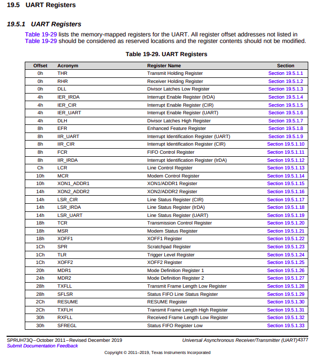
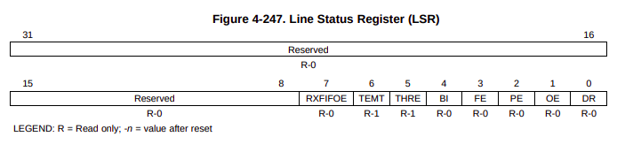
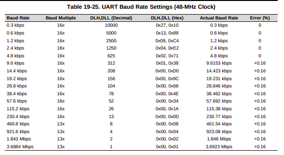
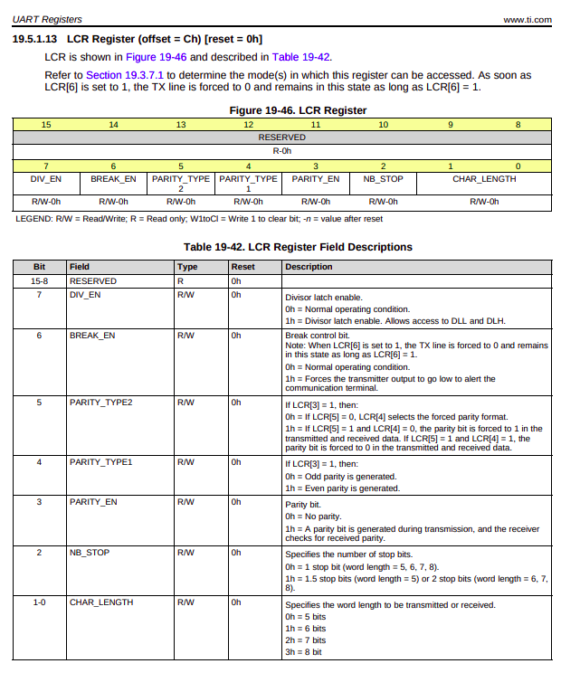

To exit qemu crtl+A then x

## UART Function

**THR(Transmitter Holding Register):** write data -> chapter 4.5.5.2  
**RBR(Receiver Buffer Register):** read  
**TSR(Transmitter Shift Register):** send bits on the wire  
**DLL(Divisor Latch LSB):** setting the speed. In other words braude rate 
**DLAB(Divisor Latch Access Bit)** 
**LSR(Line Status Register):** provides information to the CPU of status of data transfer. 
**LSR_UART:** Line status register for uart. 14h offset(0x14) -> chapter 19.5.1.19  
**LCR(Line Control Register):** Configuring how UART should behave 
**THRE(Transmit Holding Register Empty)** 
**TEMT(Transmitter Empty)** 

### Data frame

start bit + 8 bit data(1 byte) + stop bit

Start and stop bit are temporarily adding data uart hardware. So eventhough it looks 10 bits it only consist of 8 bits(data). If you want to send 'A' then the data bit -> 01000001

~~~
0 | 01000001 | 1
~~~

If FIFO enabled, it can hold 16 frames (16-byte FIFO). 

RBR, THR and DLL share one address. To acess these we need DLAB value. If DLAB = 0 -> THR/RBR. If DLAB = 1 -> DLL(to set baud rate)

If we want to write then address is base address + 0x00 (check this statement)

To find the base address we need the memory map. 

~~~
        Start address   End address     Size    Description
UART0   0x44E0_9000     0x44E0_9FFF     4KB     UART Registers
        0x44E0_A000     0x44E0_AFFF     4KB     Reserved
~~~

**UART0 base address = 0x44E09000**

0x44E0A000 - 0x44E09000 = 0x1000 bytes 
0x1000 = 4096 bytes(in decimal) = 4 KB

**LSR_UART** = UART0 base address + 0x14 = **0x44E09014**

From above image,

Bit 5: THRE -> THR is empty (can send data)

Bit 6: TEMT -> THR + TSR both empty

To check these we do bit masking

~~~
LSR & (1<<5) 
0000 0001 <- shift left 5 times
0010 0000 = 0x20
LSR & 0x20 (AND)
1 & 1 = 1 if not 0
~~~

with bit masking we can check the bit 5 and 6 value. THRE = 1 means empty

**FLow:**

- LSR bit 5 empty or not.
- If THRE = 1 write to the THR
- **THR address** is UART_BASE + 0x00 -> **0x44E09000**
- Then TSR
- Hadware add start bit, data, stop bit

~~~
If THRE = 1
   ↓
CPU writes byte
   ↓
THR (buffer)
   ↓
TSR (shift register)
   ↓
Start bit added
   ↓
Data bits sent 
   ↓
Stop bit added
   ↓
TX wire
~~~

### UART Initializing

**Baud rate** (Table 19-25)

Baud rate = Clock/(16 x Divisor)

Accoring to the table for 115200 baud rate DLH = 0x00 and DLL = 0x1A

We need to configure the uart before using it. For that we need LCR. According to the table 19-29 (chapter 19.5.1)LCR offset is 0x0C.

LCR = UART_BASE + offset
    = 0x44E09000 + 0x0C
    = 0x44E0900C

We need 8N1 conbination. This is the standard one.

8 -> data bits
N -> No parity (If enable, sends an extra bit for error checking)
1 -> 1 stop bit

so we need to consider 1-0(for char_length), 3(parity) and 2(NB_stop) bit right

Bit      Field
7        DLAB              1           
3        Parity            0
2        Stop bit          0
0-1      Char length       3

Note: Once the initialization done we have to update DLAB = 0 to send the data. Both mode uses same DLAB field in LCR register.

For char length 2 bits were reserved(0 and 1). 

~~~
00       0        5 bits
01       1        6 bits
10       2        7 bits
11       3        8 bits
~~~

Here is the final bit values

~~~
Bit:   7 6 5 4 3 2 1 0
Value: 0 x x x 0 0 1 1

In binary -> 00000011
In hex -> 0x03
~~~

**LCR = 0x03** --> normal mode

Init mode

~~~
Bit:   7 6 5 4 3 2 1 0
Value: 1 x x x 0 0 1 1
~~~

**LCR = 0x83** --> init mode

Reffer:

Table 2-2 (page 180) -> Memory Map 

4.5.5 -> UART Register

### Links

Texas Instruments: https://www.ti.com/lit/ug/spruh73q/spruh73q.pdf?ts=1777214445506

Osdev: https://wiki.osdev.org/Serial_Ports
