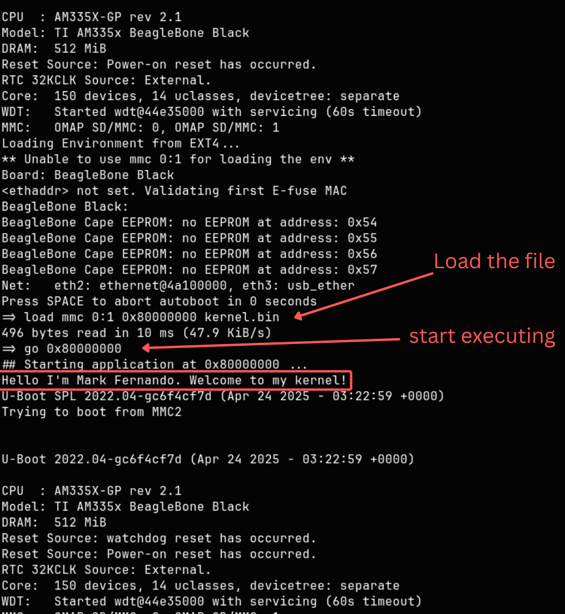

## Start-up and Configuration (26.1.5)

On this device the main MPU subsystem always starts its execution in secure mode after reset due to the
TrustZone architecture (the Secure ROM Code implements the reset handler). The Public ROM Code is physically located at the address 20000h that is immediately next to the Secure
ROM Code. (Copied from 26.1.5.1)

According to above statement when the chip powers on, the CPU starts the secure mode (ROM) and once it done it hand over to public ROM.

## Processor details

Beaglebone uses ARM Cortex-A8 based processor (AM335x chip uses this processor)

ARMv7-A architecture (32-bit ARM innstruction set)

~~~
R0–R12  -> general purpose (variables, calculations, functions)
R13     -> Stack Pointer (SP)
R14     -> Link Register (LR) : stores return address
R15     -> Program Counter (PC) : current execution address
~~~

### Linker

.text for code

.data for initialized globals

.bss for zero-initialized globals

After the make, compiler creates the kernel.elf and convert this to kernel.bin need to run following command.

~~~
arm-none-eabi-objcopy -O binary kernel.elf kernel.bin
~~~

Then copy to sd card and unmount it.

~~~
cp kernel.bin /path of the sd card
umount /path of the sd card
~~~

### loading to baglebone

~~~
-> load mmc 0:1 0x80000000 kernel.bin
-> go 0x80000000
~~~

0x80000000 is where RAM starts. So, first command loads the kernel.bin file and go starts execute the ARM instruction.

After the greeting message it rest back to onboard linux since the text was the only output.

### Links

processor details: https://developer.arm.com/documentation/ddi0344/k/

Linker script: https://developer.arm.com/documentation/107976/22-1-0/Map-code-and-data-to-your-target-device/Linker-scripts/Writing-linker-scripts

https://wiki.osdev.org/Linker_Scripts

https://www.eecs.umich.edu/courses/eecs373/readings/Linker.pdf

